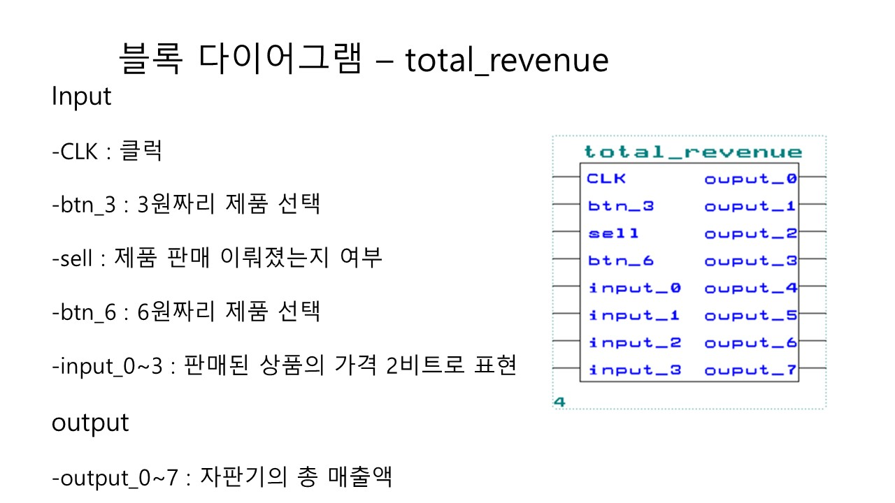

# 디지털 논리회로 기말과제: 자판기 논리회로 설계 
## 요약
- 한학기동안 배운 논리회로를 종합하여 자판기의 논리회로를 설계한다. 
Altera사의 MAX+PLUS II를 활용해 가상의 자판기를 구현한다.
- 구현해야 하는 기능
    - 화폐 투입, 제품 구입, 잔액 반환
    - [설명](Slide/슬라이드2.JPG)

## 나의 역할

나는 설계에 앞서 필히 구현해야 하는 기능을 정리하고 자판기 전체 구상도에 해당하는 전체 블록 다이어그램을 설계했다. 팀원 모두가 같은 청사진을 떠올리도록 충분히 설명을 진행했다. 이를 토대로 Top-down 방식으로 세부 설계 하도록 팀원들을 독려했다.

### 전체 블록 다이어그램 설계

자판기의 모든 시나리오에 맞는 전체 블록 다이어그램 `Vending Machine`을 설계했다.

- [설명1](Slide/슬라이드6.JPG)
- [설명2](Slide/슬라이드5.JPG)

### VendingMaking 설계

`Vending Machine`의내부 모듈 `VendingMaking`을 설계했다.

- [설명1](Slide/슬라이드7.JPG)
- [설명2](Slide/슬라이드9.JPG)
- [설명3](Slide/슬라이드10.JPG)

### Total Revenue 설계
`Vending Machine`의 내부모듈 `Total Revenue`를 설계했다.

### 역할분담

팀원
 - [송근영](Slide/슬라이드28.JPG)
 - [이성원](Slide/슬라이드29.JPG)
 - [임현강](Slide/슬라이드30.JPG)
 - [홍혜선](Slide/슬라이드32.JPG)

